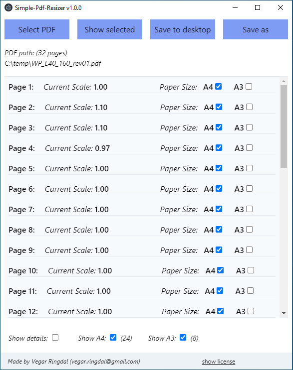

# simple-pdf-resizer

Simple app that helps set pdf pages to A4 or A3 sizes.

## how run from source
* `git clone https://github.com/vegarringdal/simple-pdf-resizer`
* `npm install`
* `npm start`

## how make new build
* `npm run make`
* see out folder

## How app looks like
